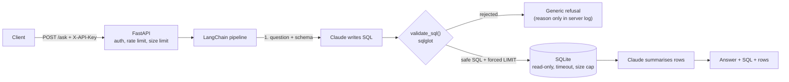

# SQL Copilot

[](https://github.com/LucasdsGomes/sql-copilot/actions/workflows/ci.yml)


Ask a business question in plain language, get an answer backed by a real SQL query. An LLM writes
the SQL, so the SQL is treated as **untrusted input**: every query passes a security validator and
runs on a read-only, time-limited connection, behind an authenticated, rate-limited API.


> A learning project on AI engineering with security as the main theme. It is **not hosted**: the
> API was deployed to a free cloud tier and tested end to end, then taken down so a paid LLM key
> is not exposed to the internet. Run it locally with your own key (see [Quickstart](#quickstart)).

## How it works



The pipeline is three plain steps (question to SQL, validate and run, rows to answer) rather than a
free-roaming agent. That keeps it easy to reason about and to test: nothing the model writes can
reach the database without going through the validator.

## Security design

No single layer is trusted. Each one assumes the layer before it failed.

| Layer | What it does | Where |
|---|---|---|
| **API** | API-key auth (constant-time compare, fails closed with no keys configured), rate limit applied *before* auth, 500-char questions, 4 KB bodies, generic errors only | `api/main.py` |
| **Prompt** | Schema shown to the model hides restricted columns; the user's text is framed as data, not instructions | `agent/prompts.py`, `db/schema.py` |
| **Validator** | Deny by default: one `SELECT` only, table allowlist, `email` blocked (also through `SELECT *`), no recursive CTEs, no `VALUES`, no system tables or table-valued functions, dangerous functions blocked, `LIMIT` always enforced. The query is regenerated from the parse tree, so comments cannot smuggle anything | `security/validator.py` |
| **Database** | Opened with `mode=ro` and `query_only`, 5 s time budget, 1 MB cap on any value, row cap | `db/connection.py` |

The tests simulate an LLM that **fully obeys an attacker** and assert the query is refused before
it reaches the database and before the second LLM call is made. Safety does not depend on the model
behaving.

## Red team

The validator was attacked by an independent agent (Antigravity): 106 probes, 14 findings reported.
Every finding was **re-verified against the real database before acting on it**:

- **Real, fixed:** recursive CTEs (CPU exhaustion), `sqlite_version()` and similar introspection,
  `VALUES` lists, CTEs named like system tables.
- **Not vulnerabilities, kept on purpose:** e.g. `LIMIT (SELECT 1000)` is replaced before it can
  run, and `date('now')` is needed for questions like "orders in the last 30 days". Each has a test
  recording *why* it is allowed ([`tests/test_redteam.py`](tests/test_redteam.py)).

## Lessons from building it

Things the tests or real measurements caught, not things that were obvious up front:

- `sqlglot` **keeps SQL comments** when regenerating a query; I had assumed it dropped them.
- `sqlite_version()` is parsed into its own node type (`CurrentVersion`), so a function-name
  blocklist alone missed it. The validator also checks by node type.
- `slowapi`'s middleware silently ignores an `async def` rate-limit handler and falls back to its
  own, which reveals the configured limit.
- Deployed on a free tier, an **IP-keyed rate limit let 26 of 80 requests through instead of 10**:
  requests reached the container through several proxy IPs, so each had its own bucket. Requests
  without a valid API key now share one global bucket; valid keys have their own. After the fix, a
  repeat of the same test let exactly 10 through.

## Limitations

- The `email` restriction is by **column name**. A different schema needs its own policy.
- The validator relies on `sqlglot` reading a query the way SQLite does. The read-only connection,
  timeout and size cap are the safety net for anything it misses.
- Rate-limit counters live in process memory, so run a single worker. Scaling out needs a shared
  store such as Redis.
- Sample data only; this is not a multi-tenant design.

## Quickstart

Requires Python 3.11+ and, for real questions, an Anthropic API key with credits.

```bash
python -m venv .venv
.venv\Scripts\activate          # Windows;  macOS/Linux: source .venv/bin/activate
pip install -e ".[dev]"
cp .env.example .env            # then edit it: ANTHROPIC_API_KEY and API_KEYS
python scripts/seed_db.py       # creates data/sales.db with fake data
pytest                          # no key or network needed: the LLM is faked in tests
```

Ask a question straight from the command line (calls the Anthropic API):

```bash
python scripts/ask.py "Top 3 cities by revenue?"
```

Check a query against the security policy (no LLM involved):

```bash
python scripts/check_sql.py "SELECT email FROM customers"
```

Run the API:

```bash
python -m uvicorn sql_copilot.api.main:app --port 8000
```

```bash
curl -X POST localhost:8000/ask -H "X-API-Key: <one of API_KEYS>" -H "Content-Type: application/json" -d "{\"question\": \"Top 3 cities by revenue?\"}"
```

| Endpoint | Auth | Notes |
|---|---|---|
| `GET /health` | none | not rate limited |
| `POST /ask` | `X-API-Key` | `{"question": "..."}`; returns `answer`, `sql`, `columns`, `rows`, or a generic refusal |
| `GET /docs` | none | interactive API docs |

### Configuration (`.env`)

| Variable | Default | Purpose |
|---|---|---|
| `ANTHROPIC_API_KEY` | | Your key. Never committed (`.env` is git-ignored) |
| `ANTHROPIC_MODEL` | `claude-haiku-4-5-20251001` | Model used for both steps |
| `API_KEYS` | | Comma-separated keys accepted by the API; empty rejects everything |
| `RATE_LIMIT` | `10/minute` | Per valid key; one shared quota for requests without a valid key |
| `MAX_ROWS` | `100` | Hard cap on rows returned |
| `DATABASE_PATH` | `data/sales.db` | SQLite file |

## Deployment

CI (GitHub Actions) runs `ruff` and `pytest` on Python 3.11 to 3.13 and builds the Docker image,
then smoke-tests the container and checks that it runs as non-root with a read-only `/app`. The
image and [`render.yaml`](render.yaml) deploy it as a free web service that only redeploys after CI
passes. Secrets are never in the image or the repository.

## Project layout

```
src/sql_copilot/
  api/        FastAPI app
  agent/      prompts and the 3-step pipeline
  security/   validate_sql()
  db/         read-only connection, schema description, sample data
scripts/      seed_db.py, ask.py, check_sql.py
tests/        pytest; the LLM is always faked
.claude/skills/sql-guardrails/   project skill documenting the SQL policy
```

## How it was built

Built with AI coding agents: Claude Code for the implementation, Antigravity for the independent
red-team review. [`AGENTS.md`](AGENTS.md) holds the project context shared between agents, and the
`sql-guardrails` skill records the SQL policy so it is not weakened by accident.
