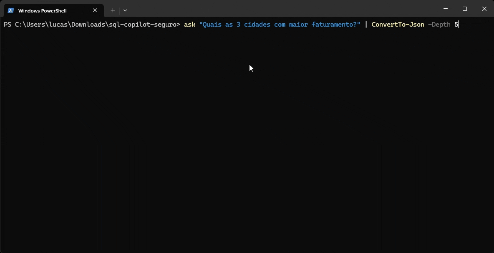
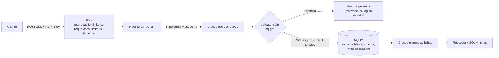

# SQL Copilot

[](https://github.com/LucasdsGomes/sql-copilot/actions/workflows/ci.yml)


Faça uma pergunta de negócio em linguagem natural e receba uma resposta baseada em uma consulta SQL
real. Um LLM escreve o SQL, então esse SQL é tratado como **entrada não confiável**: toda consulta
passa por um validador de segurança e roda em uma conexão somente leitura e com limite de tempo,
atrás de uma API autenticada e com limite de requisições.



> Projeto de estudo em engenharia de IA, com segurança como tema central. Ele **não está hospedado**:
> a API foi publicada em um plano gratuito de nuvem e testada de ponta a ponta, e depois retirada do
> ar para não expor à internet uma chave paga de LLM. Rode localmente com a sua própria chave (veja
> o [Início rápido](#início-rápido)).

## Como funciona



O pipeline tem três passos simples (pergunta para SQL, validar e executar, linhas para resposta) em
vez de um agente com liberdade total. Isso facilita raciocinar sobre ele e testá-lo: nada do que o
modelo escreve chega ao banco sem passar pelo validador.

## Desenho de segurança

Nenhuma camada é considerada confiável sozinha. Cada uma assume que a anterior falhou.

| Camada | O que faz | Onde |
|---|---|---|
| **API** | Autenticação por chave (comparação em tempo constante, falha fechada se não houver chaves configuradas), limite de requisições aplicado *antes* da autenticação, perguntas de até 500 caracteres, corpos de até 4 KB, apenas erros genéricos | `api/main.py` |
| **Prompt** | O esquema mostrado ao modelo esconde as colunas restritas; o texto do usuário é tratado como dado, não como instrução | `agent/prompts.py`, `db/schema.py` |
| **Validador** | Nega por padrão: um único `SELECT`, lista de tabelas permitidas, `email` bloqueado (inclusive via `SELECT *`), sem CTEs recursivas, sem `VALUES`, sem tabelas de sistema nem funções com valor de tabela, funções perigosas bloqueadas, `LIMIT` sempre aplicado. A consulta é regenerada a partir da árvore de parsing, então comentários não conseguem esconder nada | `security/validator.py` |
| **Banco** | Aberto com `mode=ro` e `query_only`, orçamento de 5 s, limite de 1 MB por valor, limite de linhas | `db/connection.py` |

Os testes simulam um LLM que **obedece totalmente a um atacante** e verificam que a consulta é
recusada antes de chegar ao banco e antes da segunda chamada ao LLM. A segurança não depende de o
modelo se comportar bem.

## Red team

O validador foi atacado por um agente independente (Antigravity): 106 tentativas e 14 achados
reportados. Cada achado foi **reverificado contra o banco real antes de agir**:

- **Reais, corrigidos:** CTEs recursivas (esgotamento de CPU), `sqlite_version()` e introspecção
  parecida, listas `VALUES`, CTEs com nome de tabela de sistema.
- **Não eram vulnerabilidades, mantidos de propósito:** por exemplo, `LIMIT (SELECT 1000)` é
  substituído antes de poder executar, e `date('now')` é necessário para perguntas como "pedidos nos
  últimos 30 dias". Cada um tem um teste registrando *por que* é permitido
  ([`tests/test_redteam.py`](tests/test_redteam.py)).

## Lições do desenvolvimento

Coisas que os testes ou medições reais pegaram, e que não eram óbvias de início:

- O `sqlglot` **mantém os comentários SQL** ao regenerar uma consulta; eu tinha assumido que ele os
  descartava.
- `sqlite_version()` é interpretado como um tipo de nó próprio (`CurrentVersion`), então uma lista de
  bloqueio por nome de função sozinha não a pegava. O validador também verifica pelo tipo do nó.
- O middleware do `slowapi` ignora em silêncio um handler de limite declarado como `async def` e usa
  o próprio, que revela o limite configurado.
- Publicado em um plano gratuito, um **limite de requisições por IP deixou passar 26 de 80
  requisições em vez de 10**: as requisições chegavam ao contêiner por vários IPs de proxy, e cada um
  tinha o seu contador. Agora as requisições sem chave válida compartilham um único contador global, e
  cada chave válida tem o seu. Depois da correção, repetir o mesmo teste deixou passar exatamente 10.

## Limitações

- A restrição de `email` é por **nome de coluna**. Outro esquema precisa da sua própria política.
- O validador depende de o `sqlglot` ler a consulta como o SQLite lê. A conexão somente leitura, o
  timeout e o limite de tamanho são a rede de proteção para o que ele deixar passar.
- Os contadores do limite de requisições ficam na memória do processo, então use um único worker.
  Para escalar é preciso um armazenamento compartilhado, como o Redis.
- Apenas dados de exemplo; este não é um desenho multi-inquilino.

## Início rápido

Requer Python 3.11+ e, para perguntas reais, uma chave da API da Anthropic com créditos.

```bash
python -m venv .venv
.venv\Scripts\activate          # Windows;  macOS/Linux: source .venv/bin/activate
pip install -e ".[dev]"
cp .env.example .env            # depois edite: ANTHROPIC_API_KEY e API_KEYS
python scripts/seed_db.py       # cria data/sales.db com dados fictícios
pytest                          # não precisa de chave nem de rede: o LLM é simulado nos testes
```

O `API_KEYS` vem **vazio** no `.env.example` de propósito: com ele vazio a API rejeita tudo. Gere a sua
chave e coloque no `.env`:

```bash
python -c "import secrets; print(secrets.token_hex(32))"
```

Faça uma pergunta direto pela linha de comando (chama a API da Anthropic):

```bash
python scripts/ask.py "Quais as 3 cidades com maior faturamento?"
```

Verifique uma consulta contra a política de segurança (sem LLM):

```bash
python scripts/check_sql.py "SELECT email FROM customers"
```

Rode a API:

```bash
python -m uvicorn sql_copilot.api.main:app --port 8000
```

```bash
curl -X POST localhost:8000/ask -H "X-API-Key: <uma das API_KEYS>" -H "Content-Type: application/json" -d "{\"question\": \"Quais as 3 cidades com maior faturamento?\"}"
```

| Endpoint | Autenticação | Observações |
|---|---|---|
| `GET /health` | nenhuma | sem limite de requisições |
| `POST /ask` | `X-API-Key` | `{"question": "..."}`; devolve `answer`, `sql`, `columns`, `rows`, ou uma recusa genérica |
| `GET /docs` | nenhuma | documentação interativa da API |

### Configuração (`.env`)

| Variável | Padrão | Finalidade |
|---|---|---|
| `ANTHROPIC_API_KEY` | | Sua chave. Nunca vai para o git (`.env` está no `.gitignore`) |
| `ANTHROPIC_MODEL` | `claude-haiku-4-5-20251001` | Modelo usado nos dois passos |
| `API_KEYS` | | Chaves aceitas pela API, separadas por vírgula; vazio rejeita tudo |
| `RATE_LIMIT` | `10/minute` | Por chave válida; uma cota compartilhada para requisições sem chave válida |
| `MAX_ROWS` | `100` | Limite máximo de linhas devolvidas |
| `DATABASE_PATH` | `data/sales.db` | Arquivo SQLite |

## Deploy

O CI (GitHub Actions) roda `ruff` e `pytest` em Python 3.11 a 3.13 e constrói a imagem Docker; depois
faz um teste de fumaça do contêiner e verifica que ele roda sem root e com `/app` somente leitura. A
imagem e o [`render.yaml`](render.yaml) publicam o serviço como um web service gratuito que só
redeploya depois que o CI passa. Os segredos nunca estão na imagem nem no repositório.

## Estrutura do projeto

```
src/sql_copilot/
  api/        aplicação FastAPI
  agent/      prompts e o pipeline de 3 passos
  security/   validate_sql()
  db/         conexão somente leitura, descrição do esquema, dados de exemplo
scripts/      seed_db.py, ask.py, check_sql.py
tests/        pytest; o LLM é sempre simulado
.claude/skills/sql-guardrails/   skill do projeto que documenta a política de SQL
```

## Como foi construído

Construído com agentes de IA para código: Claude Code na implementação e Antigravity na revisão
independente de red team. O [`AGENTS.md`](AGENTS.md) guarda o contexto do projeto compartilhado entre
os agentes, e a skill `sql-guardrails` registra a política de SQL para que ela não seja enfraquecida
por acidente.

## Licença

MIT. Veja [LICENSE](LICENSE).
